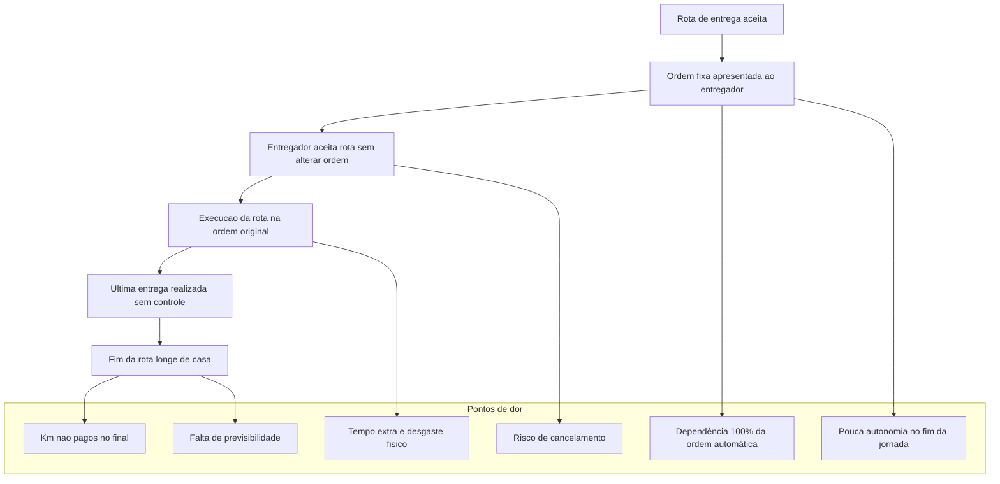
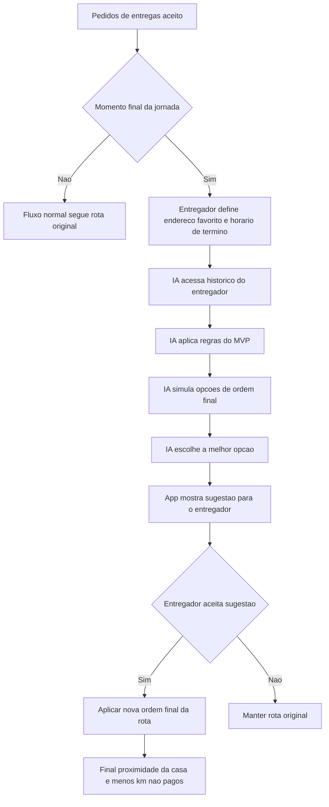

# Rota Inteligente — MVP (Final da Jornada)

Resumo rápido: Projeto autoral de Helen Ortega para reduzir o deslocamento **não remunerado** no final do turno do entregador, sem alterar valores, clientes ou quilometragem paga.  
O MVP foca no **momento final da jornada** — a definição da última entrega.

---

## 🚩 Por que isso importa
Entregadores frequentemente terminam o turno longe de casa, acumulando quilômetros não remunerados. Mudando a **ordem final das entregas já aceitas** (sem alterar valores nem clientes) é possível reduzir esse deslocamento — gerando ganho direto para o entregador e benefício operacional para a plataforma.

---

## 📉 Exemplo de impacto (comparação)

| Métrica | Rota original | Rota IA | Diferença |
|---:|---:|---:|---:|
| Total percorrido | 31,0 km | 22,2 km | – 8,8 km |
| Km pagos | 20,0 km | 20,0 km | 0 |
| Km não pagos | 11,0 km | 2,2 km | – 8,8 km |
| Tempo após a rota | ~25 min | ~6 min | – 19 min |

**Interpretação:** A IA não altera o valor pago nem modifica os clientes.  
Ela apenas reorganiza a *última etapa da rota*, reduzindo quilômetros não remunerados.

---

## 📂 Dados de exemplo
Os dados de exemplo estão nos arquivos:
- `rota_original.csv`  
- `rota_ajustada.csv`

- Ambos foram simulados com base em um padrão observado na operação real:  
**em média, as rotas equilibradas pagam aproximadamente R$ 3,00 por km**.

### Prévia (dados de exemplo)

**Rota Original**

| Etapa | Origem | Destino | Distância (km) | Valor Recebido (R$) | Pago | Observações |
|------:|--------|---------|----------------:|---------------------:|:-----:|-------------|
| 1 | Casa (Rua Porto do Una 306) | Roldão Tiradentes | 2.0 | 6.00 | Sim |Deslocamento inicial (casa → mercado)|
| 2 | Roldão Tiradentes | José Bonifácio | 3.0 | 9.00 | Sim | Entrega 1 |
| 3 | José Bonifácio | Guaianases | 2.5 | 7.50 | Sim | Entrega 2 |
| 4 | Guaianases | Inácio Monteiro | 3.0 | 9.00 | Sim | Entrega 3 |
| 5 | Inácio Monteiro | Prestes Maia | 3.5 | 10.50 | Sim | Entrega 4 |
| 6 | Prestes Maia | São Mateus | 6.0 | 18.00 | Sim | Entrega 5 |
| TOTAL_PAGO | --- | --- | 20.0 | 60.00 | Sim | Total da rota |
| VOLTA_PARA_CASA | São Mateus | Casa (Rua Porto do Una 306) | 11.0 | 0.00 | Não | Deslocamento final não pago |

**Rota Ajustada**

| Etapa | Origem | Destino | Distância (km) | Valor Recebido (R$) | Pago | Observações |
|------:|--------|---------|----------------:|---------------------:|:-----:|-------------|
| 1 | Casa (Rua Porto do Una 306) | Roldão Tiradentes | 2.0 | 6.00 | Sim | Deslocamento inicial (casa → mercado) |
| 2 | Roldão Tiradentes | Inácio Monteiro | 4.0 | 12.00 | Sim | Entrega 1 |
| 3 | Inácio Monteiro | São Mateus | 4.0 | 12.00 | Sim | Entrega 2 |
| 4 | São Mateus | Guaianases | 4.0 | 12.00 | Sim | Entrega 3 |
| 5 | Guaianases | José Bonifácio | 3.0 | 9.00 | Sim | Entrega 4 |
| 6 | José Bonifácio | Jardim São Paulo | 3.0 | 9.00 | Sim | Entrega 5 (perto de casa) |
| TOTAL_PAGO | --- | --- | 20.0 | 60.00 | Sim | Total da rota |
| VOLTA_PARA_CASA | Jardim São Paulo | Casa (Rua Porto do Una 306) | 2.2 | 0.00 | Não | Deslocamento final não pago |

---
## Fluxograma — Estado atual (pontos de dor)

## Fluxo da Solucao Proposta (IA no Final da Jornada)

## ✔️ Resultado esperado

A solução sugere automaticamente a melhor ordem final — aquela que:

- mantém o custo da plataforma idêntico  
- reduz deslocamento não remunerado  
- aproxima a última entrega do endereço favorito  
- considera histórico e preferências do entregador  

O resultado é uma experiência mais humana e eficiente no final do turno, sem alterar o funcionamento central da plataforma.

## 🧪 Teste de campo real — Rota coletada no dia 27/01/2025

Este experimento faz parte da validação do MVP da Rota Inteligente, cujo objetivo é analisar:

Em quais situações faz sentido sugerir uma reordenação apenas da última entrega, reduzindo o deslocamento não remunerado, sem alterar custo, valores ou clientes.

Para isso, coletei uma rota REAL realizada na operação como entregadora iFood, documentei os percursos e comparei:

rota original (como o app entregou)

distância de cada ponto até meu endereço favorito (Rua Porto do Una, 306)

distância final da última entrega até casa

# Dados coletados (originais do percurso)

| Etapa | Origem                                 | Destino                           | Distância (km) | Tempo   |
|-------|-----------------------------------------|------------------------------------|----------------|---------|
| 1     | Rua Porto do Una, 306 (Casa)           | Mercado Roldão Tiradentes          | 3,1 km         | 14 min  |
| 2     | Mercado Roldão Tiradentes              | R. Barbalho Bezerra, 270           | 1,8 km         | 9 min   |
| 3     | R. Barbalho Bezerra, 270               | R. Estado do Paraná, 34            | 5 km           | 24 min  |
| 4     | R. Estado do Paraná, 34                | R. das Papoulas, 28                | 1,1 km         | 7 min   |
| 5     | R. das Papoulas, 28                    | R. Bartolino de Pádua, 32          | 2,4 km         | 10 min  |
| —     | Última entrega → Casa (não remunerado) | Rua Porto do Una, 306              | 6,5 km         | 25 min  |

# Distância de cada ponto até o endereço favorito (casa)

| Ponto                       | Distância até casa | Tempo   |
|-----------------------------|--------------------|---------|
| R. Barbalho Bezerra, 270    | 1,8 km             | 5 min   |
| R. Estado do Paraná, 34     | 6 km               | 18 min  |
| R. das Papoulas, 28         | 5,6 km             | 19 min  |
| R. Bartolino de Pádua, 32   | 5,9 km             | 20 min  |

## 🧠 Análise do Teste Real — Rota 2025-11-28

Quando comparei cada entrega com a distância até meu endereço favorito, ficou evidente:

A entrega mais próxima da minha casa era a Barbalho Bezerra.

Ela já era a primeira entrega da rota original.

Reordená-la para o final aumentaria o percurso total, quebrando a regra principal do MVP:
➡️ Não aumentar a quilometragem total da rota para a plataforma.

## 🎯 Conclusão direta

Neste cenário específico, o algoritmo do iFood entregou a melhor ordem possível dentro das restrições reais.

## 📌 O que este teste PROVA sobre o MVP

Este teste reforça uma verdade central sobre o projeto:

## 👉 O MVP não é sobre mudar TODAS as rotas.

É sobre identificar QUANDO faz sentido — e quando não faz.

Em alguns cenários (como no meu MVP inicial),
trocar a última entrega reduz muito o KM não remunerado.

Em outros cenários (como este teste real),
a ordem ideal já está correta e não deve ser alterada.

Isso demonstra que:

O agente não deve forçar mudanças

O agente deve decidir com base em dados reais

A autonomia precisa ser inteligente, não automática

## 💡 Evolução da hipótese (insights da validação de campo)

Após conversar com especialistas e validar com dados reais, refinei a visão do MVP:

O objetivo não é afirmar como o algoritmo do iFood funciona.

O foco é melhorar a transparência e a autonomia no fim da jornada.

A dor real é a falta de previsibilidade sobre onde o entregador termina o dia.

A reordenação só deve acontecer quando não alterar valor/custo para a plataforma.

O entregador deve poder sinalizar:

“Quero encerrar minha jornada agora. Qual é a melhor última entrega para mim?”

Esse é o centro da proposta.

## 📎 Arquivos incluídos neste teste

/dados/rota-real-2025-01.csv — Rota completa coletada

/dados/distancias-casa-2025-01.csv — Distâncias casa → entregas

Helen Ortega — MVP de Rota Inteligente (iFood)

## ✨ Construindo uma jornada final mais humana, eficiente e justa para quem está na rua.

## ✨ Encerramento do MVP — Rota Inteligente

🔄 Mudança natural de direção — O que aconteceu depois das validações de campo

No dia 29/11, enquanto conversava com outros entregadores durante a Black Friday para continuar validando o meu MVP, perguntei a um entregador se ele achava que seria útil ter uma forma de encerrar a rota mais perto de casa.
Ele respondeu algo que me surpreendeu:

## “Isso já apareceu pra mim ontem.”

No meu aplicativo ainda não existia essa função.
Então perguntei qual era o nível dele no iFood — ele era Diamante, o nível mais alto.
A partir daí, deduzi que talvez a funcionalidade estivesse sendo testada primeiro com níveis superiores (sem afirmar como funciona, apenas observando).

Mesmo assim, como ainda não tinha aparecido para mim, continuei validando meu MVP na rua.

## 📅 E então, no dia 01/12…

O iFood lançou oficialmente a funcionalidade Rota Destino, permitindo ao entregador escolher para onde deseja ir até duas vezes ao dia.

Eu não sei como a lógica interna funciona nem quais critérios o iFood usa para calcular a rota destino.
Mas, sinceramente, eu adoraria saber — não por curiosidade, mas para entender se o meu raciocínio estava caminhando próximo de quem já constrói esse produto por dentro.

E esse lançamento me trouxe algo importante:

✔️ Confirmação de que o meu olhar estava alinhado ao produto

Mesmo trabalhando “de fora”, minha análise de dor, minha percepção de campo e minha lógica estavam apontando para uma necessidade real — a mesma que o time interno também observou.

Isso não diminui meu MVP.
Na verdade, fortalece:

➡️ Eu identifiquei e documentei uma dor real
➡️ Validei com entregadores
➡️ Construí uma solução simples, focada e orientada por dados
➡️ E essa necessidade se confirmou na prática com o lançamento oficial

Para mim, isso mostrou exatamente o que eu mais busco:

estar alinhada com impacto, com a vida real e com a visão do produto.

## 🧭 O que muda daqui pra frente

Como a dor da última entrega agora possui uma solução ativa na plataforma, este MVP é finalizado com sucesso.
Ele cumpriu o papel dele:

identificar a dor

validar com usuários reais

testar hipóteses

aprender com o campo

e ajustar o caminho

Agora sigo para a segunda dor que mapeei na operação — e que impacta fortemente a experiência do entregador:

## 🚚💡 MVP 2 — “Pedido Realmente Pronto”

(documentado em outro README)

Uma dor invisível para quem não vive o fluxo do mercado, mas totalmente real para quem está na rua — e que eu consegui acessar diretamente porque estou dentro da operação e conversei com quem vive cada etapa.

Esse é o próximo MVP que estou desenvolvendo, agora com mais repertório, mais segurança e ainda mais alinhamento com produto.
