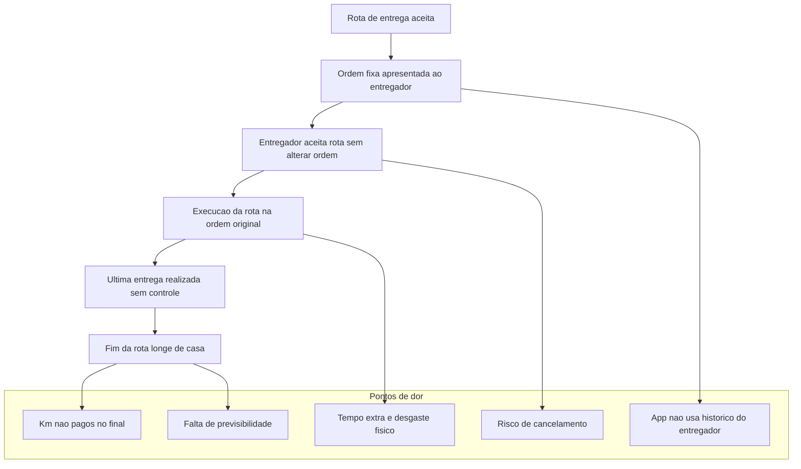
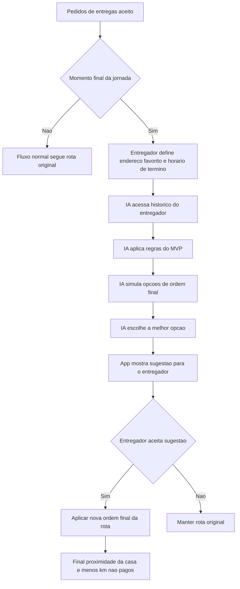

# Rota Inteligente — MVP (Final da Jornada)

**Resumo rápido:** Projeto autoral de Helen Ortega para reduzir o deslocamento **não remunerado** no final do turno do entregador, sem alterar valores, clientes ou quilometragem paga.  
O MVP foca no *momento final da jornada* — a definição da última entrega.
---

## 🚩 Por que isso importa
Entregadores frequentemente terminam o turno longe de casa, acumulando quilômetros não remunerados. Mudando a **ordem final das entregas já aceitas** (sem alterar valores nem clientes) é possível reduzir esse deslocamento — gerando ganho direto para o entregador e benefício operacional para a plataforma.

---

## 📉 Exemplo de impacto (comparação)

| Métrica | Rota original | Rota IA | Diferença |
|---:|---:|---:|---:|
| Total percorrido | 31,0 km | 22,2 km | – 8,8 km |
| Km pagos | 20,0 km | 20,0 km | 0 |
| Km não pagos | 11,0 km | 2,2 km | – 8,8 km |
| Tempo após a rota | ~25 min | ~6 min | – 19 min |

**Interpretação:** A IA não altera o valor pago nem modifica os clientes.  
Ela apenas reorganiza a *última etapa da rota*, reduzindo quilômetros não remunerados.

---

## 📂 Dados de exemplo
Os dados de exemplo estão nos arquivos:
- `rota_original.csv`  
- `rota_ajustada.csv`

- Ambos foram simulados com base em um padrão observado na operação real:  
**em média, as rotas equilibradas pagam aproximadamente R$ 3,00 por km**.

### Prévia (dados de exemplo)

**Rota Original**

| Etapa | Origem | Destino | Distância (km) | Valor Recebido (R$) | Pago | Observações |
|------:|--------|---------|----------------:|---------------------:|:-----:|-------------|
| 1 | Casa (Rua Porto do Una 306) | Roldão Tiradentes | 2.0 | 6.00 | Sim |Deslocamento inicial (casa → mercado)|
| 2 | Roldão Tiradentes | José Bonifácio | 3.0 | 9.00 | Sim | Entrega 1 |
| 3 | José Bonifácio | Guaianases | 2.5 | 7.50 | Sim | Entrega 2 |
| 4 | Guaianases | Inácio Monteiro | 3.0 | 9.00 | Sim | Entrega 3 |
| 5 | Inácio Monteiro | Prestes Maia | 3.5 | 10.50 | Sim | Entrega 4 |
| 6 | Prestes Maia | São Mateus | 6.0 | 18.00 | Sim | Entrega 5 |
| TOTAL_PAGO | --- | --- | 20.0 | 60.00 | Sim | Total da rota |
| VOLTA_PARA_CASA | São Mateus | Casa (Rua Porto do Una 306) | 11.0 | 0.00 | Não | Deslocamento final não pago |

**Rota Ajustada**

| Etapa | Origem | Destino | Distância (km) | Valor Recebido (R$) | Pago | Observações |
|------:|--------|---------|----------------:|---------------------:|:-----:|-------------|
| 1 | Casa (Rua Porto do Una 306) | Roldão Tiradentes | 2.0 | 6.00 | Sim | Deslocamento inicial (casa → mercado) |
| 2 | Roldão Tiradentes | Inácio Monteiro | 4.0 | 12.00 | Sim | Entrega 1 |
| 3 | Inácio Monteiro | São Mateus | 4.0 | 12.00 | Sim | Entrega 2 |
| 4 | São Mateus | Guaianases | 4.0 | 12.00 | Sim | Entrega 3 |
| 5 | Guaianases | José Bonifácio | 3.0 | 9.00 | Sim | Entrega 4 |
| 6 | José Bonifácio | Jardim São Paulo | 3.0 | 9.00 | Sim | Entrega 5 (perto de casa) |
| TOTAL_PAGO | --- | --- | 20.0 | 60.00 | Sim | Total da rota |
| VOLTA_PARA_CASA | Jardim São Paulo | Casa (Rua Porto do Una 306) | 2.2 | 0.00 | Não | Deslocamento final não pago |

---
## Fluxograma — Estado atual (pontos de dor)

## Fluxo da Solucao Proposta (IA no Final da Jornada)

## ✔️ Resultado esperado

A solução sugere automaticamente a melhor ordem final — aquela que:

- mantém o custo da plataforma idêntico  
- reduz deslocamento não remunerado  
- aproxima a última entrega do endereço favorito  
- considera histórico e preferências do entregador  

O resultado é uma experiência mais humana e eficiente no final do turno, sem alterar o funcionamento central da plataforma.
